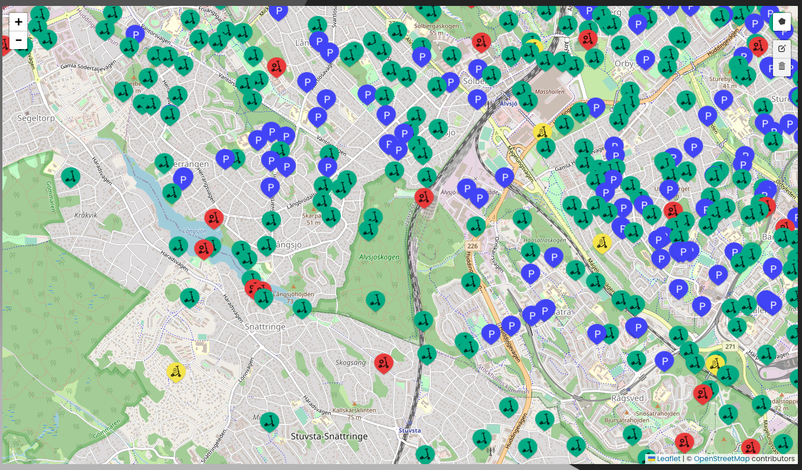

# **Dummy data for dummies - Relationships**
*By John Fredriksson, 2022-11-30*

---
## **Introduction**

In this Article we will take a look at how we can generate Dummy data, that corresponds with real world data. In addition to this we will also create data with foreign keys.

The code and use cases in this article is tailored for this project with the schema aldready created. The purpose of the article is to explore ways to create real 'fake' data and how to tackle a similar assignment.

The project is a bike rental service where our task is to model the database and fill it with Dummy data in order for the rest of team to have some data to work with.

## **Goal**

You've just built a database and created a thousand Dummy Users, but the front-end team now wants you to incorporate a new city. The launch of the city includes stations spread around the city. Every station have a certain amount of chargers. We also need a few thousand bikes, these can be found either plugged into a charger or just randomly placed around the city.

## **Break it down**

It might sound like an overwhelming task, but like all other tasks we recieve, we must break it down into smaller pieces.

#### **Create DML files with Python**

For our purpose Python is a great choice of programming language with its simplistic style, great number of modules and it is really simple to get started in.

When it comes to the output files to be read by the database, there's a few different ways to proceed.

### **Decide output format**

#### **CSV**
A CSV file is as the name implies, a **C**omma **S**eparated **V**alue file that we fill with our data and tell MYSQL to insert all rows into a specific table. While it might be a good option in some cases, it can raise a lot of [errors](https://stackoverflow.com/questions/7638090/load-data-local-infile-forbidden-in-php). Personally, I prefer to create formated DML-files.

#### **DML**
DML, or **D**ata **M**anipulation **L**anguage,  is a family of computer languages including commands permitting users to manipulate data in a database. This manipulation involves inserting data into database tables, retrieving existing data, deleting data from existing tables and modifying existing data.

Sounds like the perfect use-case for our mission today. As I built my database inside a docker container it's very easy to incorporate our DML-files into the setup when starting the container.

### **Define the target tables and relations**

In the Goal description, we can highlight some keywords in order to identify which tables we need to target. **Stations**, **Chargers** and **Bikes**. We then proceed to identify their data fields and relationship by taking a look at the DDL that creates them.

#### **Stations**
```sql
CREATE TABLE IF NOT EXISTS `mydb`.`Stations` (
  `id` INT NOT NULL AUTO_INCREMENT,
  `Name` VARCHAR(45) NOT NULL,
  `City` VARCHAR(45) NOT NULL,
  `Position` VARCHAR(45) NOT NULL,
  PRIMARY KEY (`id`));
```
No foreign keys, perfect. That makes our job a lot easier. We dont need to care about the 'id' field as we can see it's automatically generated. There are 3 fields we need to incorporate, **Name**, **City** and **Position**. We can also note that all of these fields are of the type VARCHAR(45).

#### **Chargers**
```sql
CREATE TABLE IF NOT EXISTS `mydb`.`Chargers` (
  `id` INT NOT NULL AUTO_INCREMENT,
  `Stations_id` INT NOT NULL,
  `Status` TINYINT NULL,
  PRIMARY KEY (`id`),
  INDEX `fk_Chargers_Stations_idx` (`Stations_id` ASC) VISIBLE,
  CONSTRAINT `fk_Chargers_Stations`
    FOREIGN KEY (`Stations_id`)
    REFERENCES `mydb`.`Stations` (`id`)
    ON DELETE NO ACTION
    ON UPDATE NO ACTION);
```
There they are, the foreign keys. The relationship is that a **Station** can own one or many **Chargers**, A **Charger** is owned by one **Station**. We need to take that in consideration when we generate our Dummy data for the Chargers.

Other than the foreign key we find a field containing the Chargers **Status**. In this case the **Status** is a TINYINT where '10' means it's available and '20' means it's taken.

#### **Bikes**
```sql
CREATE TABLE IF NOT EXISTS `mydb`.`Bikes` (
  `id` INT NOT NULL AUTO_INCREMENT,
  `Position` VARCHAR(45) NULL,
  `Battery` INT NULL,
  `Status` TINYINT NULL,
  `Speed` INT NULL,
  PRIMARY KEY (`id`));
```
No foreign keys. Theres four fields that we need to incorporate. Position, Battery, Status and Speed. We also note their field types.

### **File structure**
```bash
mkdir mocking
mkdir sql
touch mocking/create_stations_stockholm.py mocking/create_chargers_stockholm.py mocking/create_bikes_stockholm.py
```
The folder 'mocking' contain our python scripts to generate .SQL files. The 'sql'-folder holds our DML-files. To generate our data, our code will reside in 'create_stations_stockholm.py', 'create_chargers_stockholm.py' and 'create_bikes_stockholm.py'.

## **Python scripts**

### **Create stations**

*All changes are made in 'create_stations_stockholm.py'*

As the file name hints, I decided to launch the Swedish city Stockholm in my database. We need to define the use case of this data, what is important? The front-end team wants to visualize stations, chargers and bikes on a map in the browser. The simulation of the project also needs bikes to control.

The take-aways are:
 - The stations need to be spread around the city, exact location not to important.
 - It has to be a lot of stations since we aim to generate thousands of bikes.

The fields are:
 - Name
 - City
 - Position

We could pick every position by hand and save them to the database, but that is a quite heavy task and not the optimised method with the take-aways in mind.

Either we can data scrape the information if we can find a website that provides this data or we can use an API. I tend to rely on free and open API's which are fairly easy to come across. In this case i searched for an API with positions around stockholm and found ["Open Stockholm"](https://openstreetgs.stockholm.se/Home/Data) that supplied an API for truck parking positions around Stockholm, that will do.

I always test the API to see if the response has the necessary data for my purpose, in this case, the response has a position and a street name.

```json
"type": "FeatureCollection",
    "features": [
        {
            "type": "Feature",
            "id": "LTFR_SERVICEDAG.39818050",
            "geometry": {
                "coordinates": [
                    [
                        18.034052,
                        59.328133
                    ]
                ]
            },
            "geometry_name": "GEOMETRY",
            "properties": {
                "STREET_NAME": "Ehrensvärdsgatan",
                "CITY_DISTRICT": "Kungsholmen",
                "PARKING_DISTRICT": "Kungsholmen"
            }
        },
        ...
```
*The response has been modified slighty and stripped of unnecessary data*
<br>
<br>


Import the required modules to make the API call.
```python
import json
from urllib.request import urlopen
```

Define the URL and API key, make the request, load the response as a JSON object.
```python
url = f"https://openparking.stockholm.se/LTF-Tolken/v1/servicedagar/weekday/m%C3%A5ndag?outputFormat=json&apiKey={APIKEY}"
response = urlopen(url)
data = json.load(response)["features"]
```

Define reccuring variables.
```python
city = "Stockholm"
separator = ","
last_name = ""
```

The method '**open**' opens a file, if it doesn't exist, it will be created. In this case it tries to open the file we specify in the first argument. The second argument tells python what we want to do with the file, a '**w**' makes python know that we want to write to the file. Just be aware that opening a file with 'w' instantly deletes all previous data in that file.

With '**write**' we can write lines to the file. Here we write the lines needed to initiate the insert process.

```python
with open('../sql/insert-2-stations-stockholm.sql', 'w') as fh:
    fh.write("USE mydb\n")
    fh.write("INSERT INTO Stations\n")
    fh.write("    ( Name, City, Position )\n")
    fh.write("VALUES\n")
```

Which results in the following text
```
USE mydb
INSERT INTO Stations
    ( Name, City, Position )
VALUES
```

Looks like a great start. Now we need to filter the stations and format their data within parenthesis.

Our goal is a lot of lines looking like

```
	('Name', 'City', 'Position'),
```

Since our response object now consists of a list that contains every object we can easily iterate through each object, filter its data, format it and write it to our file. Since these loops change for every API and Database depending on their structure, I wont go into too much detail about each line.

```python
    for i, station in enumerate(data): # A for-loop to iterate each object
        name = station["properties"]["STREET_NAME"] # Break out the name
        if name == "<Gatunamn saknas>": # If case when theres no name
            name = station["properties"]["CITY_DISTRICT"] # Set fallback name
        if name != last_name: # Remove duplicates
            lat = station["geometry"]["coordinates"][0][1] # Break out latitude
            lon = station["geometry"]["coordinates"][0][0] # Break out longitude
            position = f"{lat},{lon}" # Format position string according to database
            if i == len(data) - 1: # If last object in data
                separator = ";" # Change the separator to ';' to close command

            fh.write(f"      ('{name}', '{city}', '{position}'){separator}\n") # Write a formated insert line to our file
        last_name = name # Save the name for next iteration to avoid duplicates
```

We run our python script and see that a file called 'insert-2-stations-stockholm.sql' has appeared in th 'sql'-folder. If we open the file we can see our insert script with a 1677 stations with correct coordinates and names.

```sql
USE mydb
INSERT INTO Stations
    ( Name, City, Position )
VALUES
      ('Ehrensvärdsgatan', 'Stockholm', '59.328133,18.034052'),
      ('Sankt Eriksgatan', 'Stockholm', '59.328994,18.028725'),
      ('Sankt Göransgatan', 'Stockholm', '59.338502,18.013299'),
      ('Mariedalsvägen', 'Stockholm', '59.339304,18.015215'),
      ('Kungsholmstorg', 'Stockholm', '59.327247,18.041986'),
      ('Vidängsvägen', 'Stockholm', '59.338288,17.978116'),
      ('Fridhemsgatan', 'Stockholm', '59.32985,18.026265'),
      ('Kungsholmstorg', 'Stockholm', '59.327198,18.04236'),
      ('Sankt Eriksgatan', 'Stockholm', '59.329764,18.029443'),
      ('Arvodesvägen', 'Stockholm', '59.299404,17.983818'),
      ('Bokbindarvägen', 'Stockholm', '59.300364,17.987535'),
      ('...', '...', '...'),
      ('John Bergs Plan', 'Stockholm', '59.336428,18.022384');
```

The final script should look like this.

```python
APIKEY = "YOUR API KEY"

import json
from urllib.request import urlopen

url = f"https://openparking.stockholm.se/LTF-Tolken/v1/servicedagar/weekday/m%C3%A5ndag?outputFormat=json&apiKey={APIKEY}"
response = urlopen(url)
data = json.load(response)["features"]
city = "Stockholm"
separator = ","
last_name = ""

with open('../sql/insert-2-stations-stockholm.sql', 'w') as fh:
    fh.write("USE mydb\n")
    fh.write("INSERT INTO Stations\n")
    fh.write("    ( Name, City, Position )\n")
    fh.write("VALUES\n")

    for i, station in enumerate(data):
        name = station["properties"]["STREET_NAME"]
        if name == "<Gatunamn saknas>":
            name = station["properties"]["CITY_DISTRICT"]
        if name != last_name:
            lat = station["geometry"]["coordinates"][0][1]
            lon = station["geometry"]["coordinates"][0][0]
            position = f"{lat},{lon}"
            if i == len(data) - 1:
                separator = ";"

            fh.write(f"      ('{name}', '{city}', '{position}'){separator}\n")
        last_name = name

```

Now that we have our stations, we can move on to their chargers.

### **Create chargers**

*All changes are made in 'create_chargers_stockholm.py'*

Okay, so now we need to generate a few chargers for each station and the charger must have a foreign key which is the station id. If these are the only stations that we are going to create it would be quite easy to just start iterate from 1 to the number of stations and insert the current iteration as the foreign key. But in my case, I already have a few stations from another city.

My Stations table tells me I have 100 stations prior to inserting Stockholm, in my Stockholm insert there's 1677 stations. This means I want to iterate from 0 to 1677 with a counter that starts at 101 to act as the foreign key.

We also need to supply the charger with a status code, 10 means it's available, 20 means it's taken.

I have decided to give each station 5 chargers where 3 are taken and 2 are available. So lets jump into the code, first we declare the standard separator, the code to open the file and the lines to begin our insert statement

```python
separator = ","

with open('../sql/insert-4-chargers-stockholm.sql', 'w') as fh:
    fh.write("USE mydb\n")
    fh.write("INSERT INTO Chargers\n")
    fh.write("    ( Stations_id, Status )\n")
    fh.write("VALUES\n")
```
Then we create our loop that will iterate through the specified numbers and print the correct and formated lines to our DML file.

```python
    counter = 101 # Set the counter, this variable will be used as foreign key
    for n in range(0, 1677): # For loop to iterate through every station
        for k in range(0,3): # For loop to create 3 taken stations
            fh.write(f"      ('{counter}', '20'){separator}\n") # Write the lines
        for k in range(0,2): # For loop to create 2 available stations
            if n == 1676 and k == 1: # If last iteration
                separator = ";" # Change separator to ';' to end statement
            fh.write(f"      ('{counter}', '10'){separator}\n") # Write the line
        counter += 1 # Add +1 to the counter to keep track of foreign key

```

If we run the script and take a look at 'insert-4-chargers-stockholm.sql' we now have 8410 valid chargers throughout Stockholm with varying statuses.

The final script should look like this.

```python
separator = ","

with open('../sql/insert-4-chargers-stockholm.sql', 'w') as fh:
    fh.write("USE mydb\n")
    fh.write("INSERT INTO Chargers\n")
    fh.write("    ( Stations_id, Status )\n")
    fh.write("VALUES\n")
    counter = 101
    for n in range(0, 1677):
        for k in range(0,3):
            fh.write(f"      ('{counter}', '20'){separator}\n")
        for k in range(0,2):
            if n == 1676 and k == 1:
                separator = ";"
            fh.write(f"      ('{counter}', '10'){separator}\n")
        counter += 1

```

### **Create bikes**

*All changes are made in 'create_bikes_stockholm.py'*

Stay with me, this part gets tricky.

In my case I need to generate data for the following fields:
- Position: string in the format "latidude,longitude".
- Battery: integer between 0 and 100.
- Status: tinyint where 10 = "available", 30 = "no battery, 40 = "charging" and 50 = "maintenance needed".
- Speed: integer in km/h

Since we defined in our chargers that 3/5 chargers are taken and has a bike charging in it, we need to take that into consideration when generating the bikes. I've decided to create 5 bikes for each station where 3 of them are placed in a charger and 2 are spawned near the station to add a little randomness to the positioning.

The script will make the same API call and filter the response in same way as we did in or stations script, because we need to access the coordinates from the station. A charging bike should share location with a charger which already share its location with the station.

So the plan is to iterate through each station and for each station create 5 bikes.

The 2 first bikes will get a generated Position based on the stations position and a supplied radius. The Battery will be a random integer between 0-100. The Status depends on the battery as we take advantage of this random integer to also add randomness to statuses, if the battery is between 54-59 the Status will be set to 50, meaning it has a 6% chance of being broken and in need of maintenance. If the battery is less than 3% the Status will be 30 meaning the battery level is too low and finally the Status will be set to 10 meaning available, in all other scenarios. Speed will be set to 0.

The 3 last bikes will get its Position set to the stations position, Battery as a random integer between 0-100, Status to 40 meaningit's charging and the Speed will be set to 0.

That's alot of instructions to take in with only text, let's take a look at the code. First import required modules.

```python
import random
import json
from urllib.request import urlopen
```

Set your API key and url, make the request and handle the response.

```python
APIKEY = "YOUR API KEY" # Specified API key 
url = f"https://openparking.stockholm.se/LTF-Tolken/v1/servicedagar/weekday/m%C3%A5ndag?outputFormat=json&apiKey={APIKEY}" # Specified url with API key included
response = urlopen(url) # Making the call
data = json.load(response)["features"] # Get a list of all objects
```

Set global variables.

```python
separator = "," # Character to separate each line
radius = 0.02 # 0.02 in this scenario translates to roughly 2500 meters
last_name = "" # Keep track of last name to avoid duplicates
```

As we've done in previous scripts, write the lines to initiate the insert command.

```python
with open('../sql/insert-3-bikes-stockholm.sql', 'w') as fh:
    fh.write("USE mydb\n")
    fh.write("INSERT INTO Bikes\n")
    fh.write("    ( Position, Battery, Status, Speed )\n")
    fh.write("VALUES\n")
```

Create a for-loop that iterates through each station and only proceeds to write lines if the current station isn't a name duplicate of the previous

```python
    for i, station in enumerate(data): # Create the for-loop
        name = station["properties"]["STREET_NAME"] # Set the name
        if name == "<Gatunamn saknas>": # If name is missing
            name = station["properties"]["CITY_DISTRICT"] # Set fallback name

        position = [station["geometry"]["coordinates"][0][1],station["geometry"]["coordinates"][0][0]] # Extract the station coordinates
        
        if name != last_name: # Proceed if current station isn't a duplicate
```

Create a for-loop that generates 2 non-charging bikes with relative data.

```python
            for n in range(0, 2): # Create a for loop to generate non-charging bikes
                destination_lat = random.uniform(float(position[0])-radius,float(position[0])+radius) # Calculate destination latitude based on radius from "radius" variable
                destination_lon = random.uniform(float(position[1])-radius,float(position[1])+radius) # Calculate destination longitude based on radius from "radius" variable
                new_position = f"{destination_lat},{destination_lon}" # The new generated position
                
                battery = random.randint(0,100) # Generate a battery level

                if battery < 3: # If battery is less than 3
                    status = 30 # Set status to "no battery"
                else:
                    if battery < 60 and battery > 53: # 6% chance to proceed
                        status = 50 # Set status to "Need maintenance"
                    else:
                        status = 10 # Set status to "Available"
                
                speed = 0 # Set speed to 0
                fh.write(f"      ('{new_position}', '{battery}', '{status}', '{speed}'){separator}\n") # Take all values, format it into SQL and write it
```

Create a for-loop that generates 3 charging bikes with relative data.

```python
            for n in range(0,3): # Create a for-loop to create chargin bikes
                battery = random.randint(0,100) # Generate a battery level
                status = 40 # Set status to "Charging"
                speed = 0 # Set speed to 0
                if i == len(data) - 1 and n == 4: # If last iteration
                    separator = ";" # Set separator to ';' to execute SQL statement
                fh.write(f"      ('{position[0]},{position[1]}', '{battery}', '{status}', '{speed}'){separator}\n") # Take all values, format it into SQL and write it
```

Save the current iterations station name in the global variable to avoid a duplicate in the next iteration

```python
        last_name = name # Set last name to current name to avoid duplicates in next iteration
```

Ouuff, that was a lot. Let's take a look at the full script.

```python
import random
import json
from urllib.request import urlopen

APIKEY = "YOUR API KEY"
url = f"https://openparking.stockholm.se/LTF-Tolken/v1/servicedagar/weekday/m%C3%A5ndag?outputFormat=json&apiKey={APIKEY}"
response = urlopen(url)
data = json.load(response)["features"]

separator = ","
radius = 0.02
last_name = ""

with open('../sql/insert-3-bikes-stockholm.sql', 'w') as fh:
    fh.write("USE mydb\n")
    fh.write("INSERT INTO Bikes\n")
    fh.write("    ( Position, Battery, Status, Speed )\n")
    fh.write("VALUES\n")
    for i, station in enumerate(data):
        name = station["properties"]["STREET_NAME"]
        if name == "<Gatunamn saknas>":
            name = station["properties"]["CITY_DISTRICT"]

        position = [station["geometry"]["coordinates"][0][1],station["geometry"]["coordinates"][0][0]]
        
        if name != last_name:
            for n in range(0, 2):
                destination_lat = random.uniform(float(position[0])-radius,float(position[0])+radius)
                destination_lon = random.uniform(float(position[1])-radius,float(position[1])+radius)
                new_position = f"{destination_lat},{destination_lon}"
                
                battery = random.randint(0,100)

                if battery < 3:
                    status = 30
                else:
                    if battery < 60 and battery > 53:
                        status = 50
                    else:
                        status = 10
                
                speed = 0
                fh.write(f"      ('{new_position}', '{battery}', '{status}', '{speed}'){separator}\n")

            for n in range(0,3):
                battery = random.randint(0,100)
                status = 40
                speed = 0
                if i == len(data) - 1 and n == 4:
                    separator = ";"
                fh.write(f"      ('{position[0]},{position[1]}', '{battery}', '{status}', '{speed}'){separator}\n")

        last_name = name
```

If we take a look at the new file 'insert-3-bikes-stockholm.sql we can find ~8400 bikes with varying statuses and positions.

```sql
USE mydb
INSERT INTO Bikes
    ( Position, Battery, Status, Speed )
VALUES
      ('59.289465774560654,18.10327069403234', '52', '10', '0'),
      ('59.25805627327652,18.090747717122383', '86', '10', '0'),
      ('59.271038,18.083994', '21', '40', '0'),
      ('59.271038,18.083994', '38', '40', '0'),
      ('59.271038,18.083994', '84', '40', '0'),
      ('59.35439001662182,17.90168406495147', '9', '10', '0'),
      ('59.33617409555911,17.90258673560694', '50', '10', '0'),
      ('59.34721,17.883214', '58', '40', '0'),
      ('59.34721,17.883214', '46', '40', '0'),
      ('...', '...', '...', '...'),
      ('59.341616342705414,17.879426969423765', '1', '30', '0');
```

## **Test it out!**
I ran the DML files in our MYSQL database and accessed the data through a react app with the leaflet module.

And voila!



## **Summary**
We recieved a task to launch a new city in the database, defined what our goal would be. Studied the schema to determine what tables and fields would be affected. We identified relationships between the tables and structured our workflow accordingly.

With the help of a public and free API we localised over a 1000 real positions spread around the selected city, we took this data and formatted it into DML-files which makes insert queries to our database.

Each station were given 5 chargers with varying statuses depending on it being used or not. This resultet in ~8400 stations with a foreign key to its owner station.

For each station 5 bikes were created, 3 of which charging in a charger whose status is occupied. 2 bikes were randomly placed around the selected station. Each bike has a random status and battery to add som variation to our data.

The code in this article is clearly tailored for this database, project and purpose of the example. But the main purpose of the article is not to give you the code to solve your task, it's to show you how you can tackle a problem where you need to generate large amounts of data for a database with relationships in consideration.
