# **Meet Redis, the first introduction to the in-memory cache.**
*By John Fredriksson, 2022-12-02*

---
## **Introduction**
In this article we will take a look at Redis, the in-memory data structure store. The first part will take us through the process of learning and experiment with a new technology together for the first time. Area of focus is how to navigate in the Redis Client, its data types and how to store data.

In the second part we'll take our new found knowledge and implement it in our current stack. Identify possible use-cases and test if Redis is the right choice for us.

## **Goal**
You've just built a database filled with thousands and thousands of rows with data. The front-end team appreciates the great amount of data to fetch but feel like the database is a bit slow. Every time the want to fetch the users or other objects they need to pull all the data from the database.

On your way to work this morning, you spotted a big sign on the bus that read '**Redis, speed up your database fetches by 10-50 times**'. Wow, can that be true?

You head straight to your computer and started studying Redis, now you have a clear goal for todays task.

We need to
- Understand what Redis is
- Install it
- Learn its syntax
- Test out the storage options

and then figure out
- Its pros and cons
- Define a use-case for our project
- Implement Redis in our project
- Study the result

## **Get started with Redis**

### **What is Redis?**
We need to understand what Redis is and [Amazon puts it in a great way](https://aws.amazon.com/redis/),

    "Redis, which stands for Remote Dictionary Server, is a fast, open source, in-memory, key-value data store. The project started when Salvatore Sanfilippo, the original developer of Redis, wanted to improve the scalability of his Italian startup. From there, he developed Redis, which is now used as a database, cache, message broker, and queue.
    
    Redis delivers sub-millisecond response times, enabling millions of requests per second for real-time applications in industries like gaming, ad-tech, financial services, healthcare, and IoT. Today, Redis is one of the most popular open source engines today, named the "Most Loved" database by Stack Overflow for five consecutive years. Because of its fast performance, Redis is a popular choice for caching, session management, gaming, leaderboards, real-time analytics, geospatial, ride-hailing, chat/messaging, media streaming, and pub/sub apps."

It all sounds really impressive, in our case we will focus on the cache part. We want to cache the data that we retrieve from the database to enable the sub-millisecond response time since our application will be used by a few thousand users simultaneously. Lets dive into it.

### **Install Redis**
Theres a few options when it comes to installing Redis, the traditional way would be to install the package locally. Since my project is run in a docker container, I would like to create a container from the official Redis image.

```
docker run --rm --name rdc -d redis
```
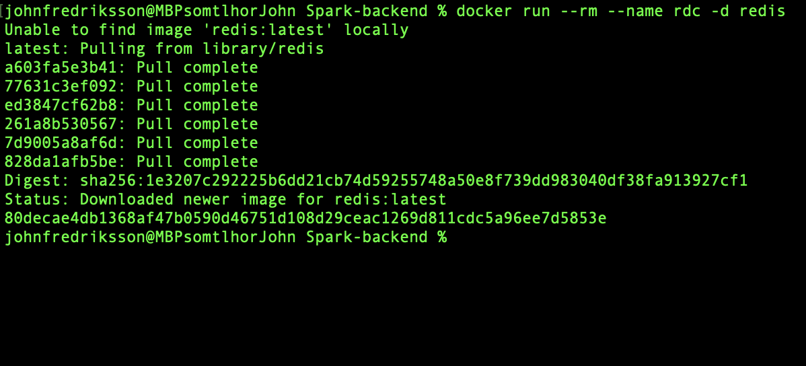 
*The first time we run the image we need to pull the files if you don't have them locally*


The line above does the following
- **docker run**  Tells docker that we want to run a container
- **--rm** Automatically removes the container when exited
- **--name rdc** Sets the container name to rdc so its easier to reference it
- **-d** Sets the container in detached mode, meaning it will run in the background and wont occupy our terminal
- **redis** Tells docker which image we want to use

With ```docker ps``` we can see that its status is 'up'.
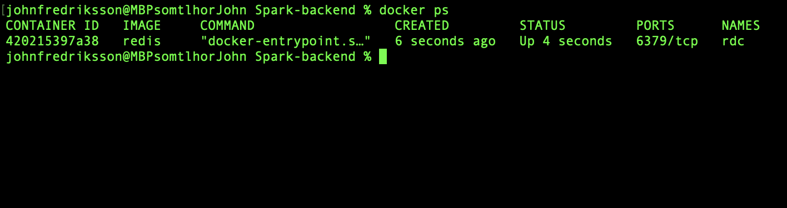

To close the container we simply put  ```docker stop rdc``` as it tells docker to stop the container named 'rdc'.
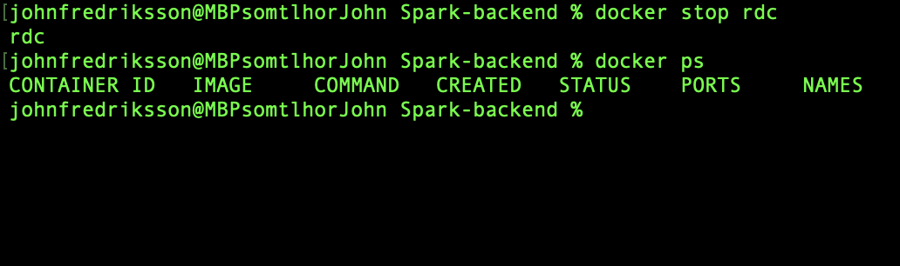

### **Learn its syntax**
Fire up the container again with command we just learned. Now we need to access the Redis Client in order to store some data. To do this, type
```
docker exec -it rdc redis-cli
```
The line above does the following
- **docker exec** Tells docker to execute a command in a running container
- **-it** Tells docker that we want to stay in the container after command is executed
- **rdc** The target container
- **redis-cli** The command to be executed

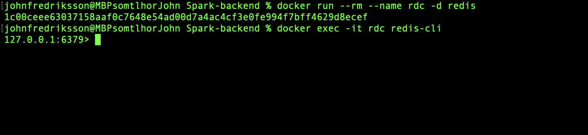
*Looks like we have a working testing environment.*

### **Data types**

Redis has a long list of different data types to choose from, in this article we'll take a look at the following

#### **Strings**
Redis strings store sequences of bytes, including text, serialized objects, and binary arrays. As such, strings are the most basic Redis data type. They're often used for caching, but they support additional functionality that lets you implement counters and perform bitwise operations, too.

#### **Lists**
Redis lists are linked lists of string values. Redis lists are frequently used to:
- Implement stacks and queues.
- Build queue management for background worker systems.

#### **Sets**
A Redis set is an unordered collection of unique strings (members). You can use Redis sets to efficiently:

- Track unique items (e.g., track all unique IP addresses accessing a given blog post).
- Represent relations (e.g., the set of all users with a given role).
- Perform common set operations such as intersection, unions, and differences.

#### **Hashes**
Redis hashes are record types structured as collections of field-value pairs. You can use hashes to represent basic objects and to store groupings of counters, among other things.

### **Test out the storage options**
Okay, enough reading, let's try to store some data in our Redis container. Lets start with some strings.

#### **Set and get**
To save a key-value pair we use the ```SET <key> <value>``` keyword, to retrieve it we use ```GET <key>```.
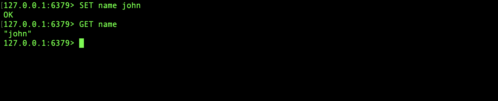

#### **Setex**
Since Redis can be used as a cache we are able to set an expiration timer for each key.
```
SETEX <key> <seconds> <value>
```
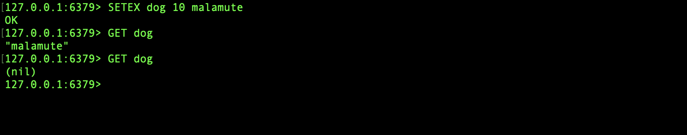

#### **Delete key**
To delete a key you can use the following command
```
DEL <key>
```
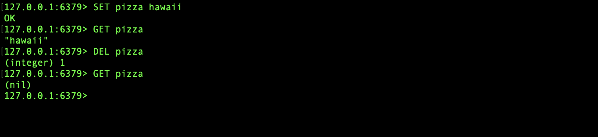

#### **Lists**
If you want a list as your data type you can initiate it with
```
LPUSH chores dishes
```
As you can see in the example below theres a few other commands to use aswell
- **LPUSH** Add a value at the head
- **RPUSH** Add a value at the tail
- **LPOP** Remove from the head
- **RPOP** Remove from the tail
- **LRANGE** Get values between indexes
- **LLEN** Get the length of the list

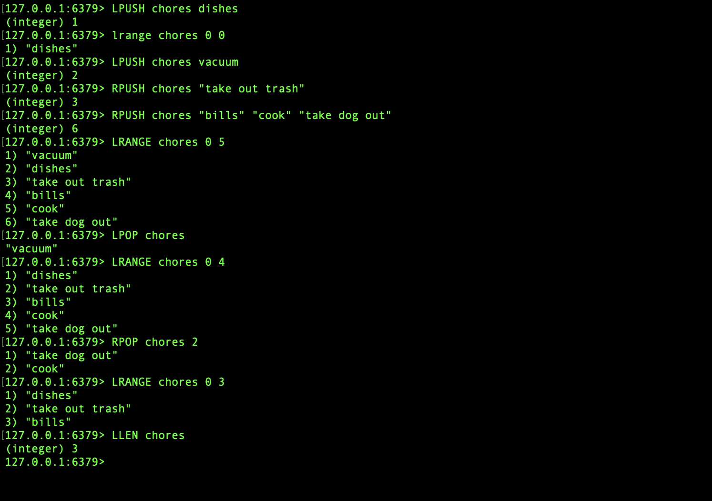

#### **Sets**
With sets we can easily keep track of unique items, lets add some colors I like.
```
SADD colors red
```
As you can see in the example below theres a few other commands to use aswell
- **SISMEMBER** See if a value is a member of the set
- **SREM** Remove a value from the set
- **SCARD** Get the number of members

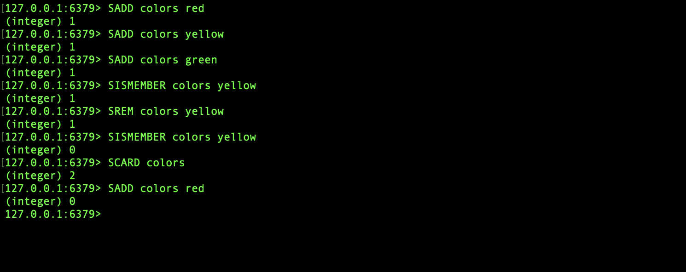

#### **Hashes**
We can create hashes which work as objects, but in Redis we are not allowed to nest. So a hash instance is a key with multiple key-value pairs. Lets create one.
```
HSET person name john age 27 country sweden
```
As you can see in the example below theres a few other commands to use aswell
- **HGET** Get a specific value from a hash key
- **HMGET** Get multiple values from the hashes keys
- **HINCRBY** Increment the value at the hash key by supplied amount

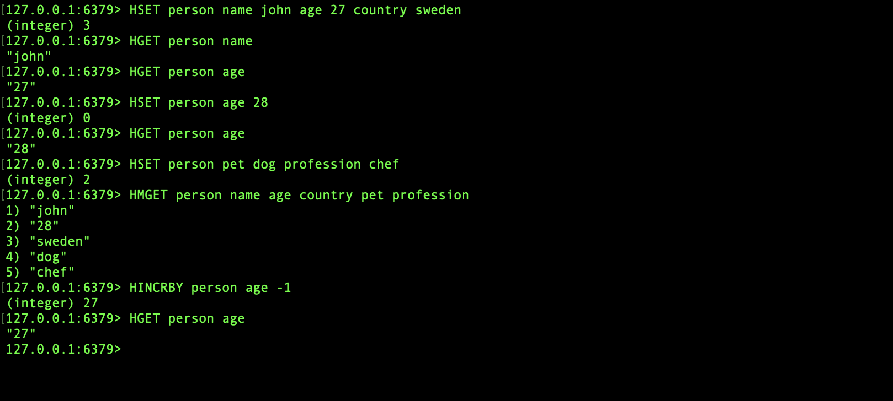

## **Redis in our project**

### **Redis pros & cons**
We've just went through some of the basics of Redis as we used docker to create a background container from the Redis image, accessed the Redis-client and tried out some syntax with various data types. The whole process felt quite straight forward and the covered data types were easy to grasp as soon as we got to use them in the terminal.

Just as any other database Redis also have its pros and cons, lets take a look at what [Cloud Infrastructure Services](https://cloudinfrastructureservices.co.uk/the-differences-between-mongodb-vs-redis-pros-and-cons/) has to say.

**Pros**
- It is one of the fastest caching technologies on the market. Its throughput is often limited by the available network strength or size and then the processor size.
- Its flexible data structures support all different kinds of data storage scenarios. Each key-value pair can save up to 512 MB of data, giving a chance to save enormous data in just one object.
- Redis has its own hashing technique that is used to boost read and write performance significantly. However, it is dependent on factors like available RAM size on Redis and the number of objects you want to store.
- Redis supports asynchronous replication because of its low latency and high performance. It also supports a dedicated WAIT command that is used to induce synchronous replication.

**Cons**
- Redis is essentially a data structure server. It supports commands and doesn’t support a query language, so there is no case of using ad-hoc queries. Data access paths have to be designed, and this results in a loss of flexibility.
- The security offered by Redis is pretty basic. It only provides data access rights.
- To achieve scalability, Redis requires setting up and deploying multiple instances of itself. However, the enterprise-level product of Redis promises easy scalability and support for sharding as well.

### **Is there a use-case for Redis in our project?**
Based on our research so far in the article I'm confident to say that I've found a few use-cases. There are some situations where our application fetches large amounts of data from our MYSQL database through the express.js API server. I would like to implement Redis as a layer between the database and the API in order to cache the large amounts of data recently fetched by the API.

As we are building a bike rental service application, there is a scenario where one user wants to see all available bikes in their app. The user requests the data from the API, the API checks if Redis has the data cached. It appears to not be cached so we have to fetch the data from the database, but before we send it back to the user we let Redis cache it.

0.5 seconds later another user wants to see all available bikes so the request is sent to the API, the API checks if Redis has the data cached, the data is cached so we can proceed to send it back to the user without having to deal with the database.

### **Implement Redis**

#### **docker-compose**
As my project is split up into different docker containers we'll have to do the same with Redis. There's two containers for the backend, one being the MYSQL server and the other being the nodejs server. To run the containers I have a docker-compose.yml file that lists both containers as services.

To make our Redis container fit in our docker environment we need to
- List it as a service
- Map the port 6379
- Initiate the Redis server
- Map a volume
- Connect to a docker network
- Link Redis to our API

Lets take a look at my docker-comose.yml file

```yaml
version: "3"
networks:
  dbwebb:

services:
  db:
    build:
      context: ./Spark-mysql
      dockerfile: Dockerfile
    container_name: mysql-db
    image: spark-backend-db:v1.0
    restart: always
    ports:
      - 3308:3306
    networks:
      dbwebb:

  server:
    build:
      context: ./Spark-API-v1
      target: builder
      dockerfile: Dockerfile
    container_name: api-server
    image: spark-backend-server:v1.0
    env_file:
      - "./Spark-API-v1/.env"
    volumes:
      - "./Spark-API-v1:/app"
    restart: always
    depends_on:
      - db
    stdin_open: true
    tty: true
    ports:
      - "3000:3000"
    networks:
      dbwebb:
    links:
      - db:mysql-db
```
As stated I have two services, the database and the API. Lets add a Redis service, similar to our docker run command from earlier

```yaml
  cache:
    image: redis:6.2-alpine # A slimmer version of the Redis image
    container_name: cache # Name our container
    restart: always # Always restart container if it fails
    ports:
      - '6379:6379' # Map the inside port to be available from the outside port, outside:inside
    command: redis-server # Run the 'redis-server' command to start the server
    volumes: 
      - cache:/data # Map a volume to store the data
    networks:
      dbwebb: # Connect the service to our docker network
```

Since the API is depending on the Redis cache, its important to make docker aware of it. We state it in our docker-compose so the Redis cache is launched before the API, and while we're at it, lets link the cache to the API so we can access it from our express server

```yaml
server:
  build:
    context: ./Spark-API-v1
    target: builder
    dockerfile: Dockerfile
  container_name: api-server
  image: spark-backend-server:v1.0
  env_file:
    - "./Spark-API-v1/.env"
  volumes:
    - "./Spark-API-v1:/app"
  restart: always
  depends_on:
    - db
    - cache # Make docker know that the server depends on Redis container
  stdin_open: true
  tty: true
  ports:
    - "3000:3000"
  networks:
    dbwebb:
  links:
    - db:mysql-db
    - cache:cache # Link the Redis cache to the server
```

Make sure you define the volume aswell

```yaml
volumes:
  cache:
    driver: local
```

And our finished docker-compose.yml script should look like this

```yaml
version: "3"
networks:
  dbwebb:

services:
  db:
    build:
      context: ./Spark-mysql
      dockerfile: Dockerfile
    container_name: mysql-db
    image: spark-backend-db:v1.0
    restart: always
    ports:
      - 3308:3306
    networks:
      dbwebb:

  cache:
    image: redis:6.2-alpine
    container_name: cache
    restart: always
    ports:
      - '6379:6379'
    command: redis-server
    volumes: 
      - cache:/data
    networks:
      dbwebb:

  server:
    build:
      context: ./Spark-API-v1
      target: builder
      dockerfile: Dockerfile
    container_name: api-server
    image: spark-backend-server:v1.0
    env_file:
      - "./Spark-API-v1/.env"
    volumes:
      - "./Spark-API-v1:/app"
    restart: always
    depends_on:
      - db
      - cache
    stdin_open: true
    tty: true
    ports:
      - "3000:3000"
    networks:
      dbwebb:
    links:
      - db:mysql-db
      - cache:cache

volumes:
  cache:
    driver: local
```

To build our services we use
```
docker-compose build
```

To run our services we use
```
docker-compose up
```

We can also run a single service
```
docker-compose up cache
```

We can also run a single service in detached mode
```
docker-compose up -d cache
```

To stop our services we use
```
docker-compose down
```

#### **Redis in our server**
Start by installing the Redis client in your node server
```node
npm i redis
```
I want to implement Redis where my server fetches all 10000 bike objects from the database, the route responsible for that looks like this

```js
// Without redis
router.get("/bike", async (req: Request, res: Response) => {
    try {
        let allBikes = await bikeModel.showAllBikes();
        return res.status(200).send(allBikes);
    } catch (error) {
        return res.status(404).send(error);
    }
});
```

The goal is for the client to ask for the data, the server will check if Redis has the data cached. If yes, return it. If no, fetch it from the database, cache it and then return it.

Lets import and initiate the Redis-client

```js
const Redis = require('redis');

let redisClient = Redis.createClient({
    legacyMode: true,
    socket: {
      port: 6379,
      host: "cache"
    }
});
      
redisClient.connect().catch(console.error)
```
legacyMode enables functionality from both Redis v3 and v4. In the socket we used the port and host that we defined in our docker-compose. Then we establish a connection to the redis-client, we are now ready to use Redis.

To use the redis-client in nodejs it's the same procedure as the command line.

To get a key value we use
```js
redisClient.get("KEY");
```

To set a key we use
```js
redisClient.set("KEY", "VALUE");
```

To set a key with a expiration timer of 5 seconds we use
```js
redisClient.setex("KEY", 5, "VALUE");
```

Lets modify the original route to GET the Redis key, return if there's any data. Otherwise fetch it, cache it, send it. Our focus lies within the try block, lets cache the data we recieve from the database.

```js
// Implementing redis
    let allBikes = await bikeModel.showAllBikes();
    redisClient.setex('bikes', 5, JSON.stringify(allBikes)); // Cache
    return res.status(200).send(allBikes);
```
With one line of code we have successfully cached the whole response. Since we are working with Redis strings we simply stringify the response before caching it.

At the moment we only save the data and never actually use it. We'll add a Redis 'GET' method to fetch the value and handle the response with a callback that, if exists, returns the data. If it's empty we move onto the 'SET'-part.
```js
// Implementing redis
    redisClient.get('bikes', async (error:Error, bikes:string) => {
        if (error) console.error(error);

        if (bikes != null) {
            return res.status(200).send(JSON.parse(bikes));
        }
        ...
    })
```

If we put it all together we are left with a method that looks like this
```js
// With redis
router.get("/bike", async (req: Request, res: Response) => {
    try {

        redisClient.get('bikes', async (error:Error, bikes:string) => {
        if (error) console.error(error);

        if (bikes != null) {
            return res.status(200).send(JSON.parse(bikes));
        }

        let allBikes = await bikeModel.showAllBikes();
        redisClient.setex('bikes', 5, JSON.stringify(allBikes));
        return res.status(200).send(allBikes);
        })

    } catch (error) {
        return res.status(404).send(error);
    }
});
```

### **What did it do?**
Redis is now a container in our docker environment and connected to our server. It's implemented as a layer between the server and database in order to make response times faster.

How did it do?

Lets build and start our services.
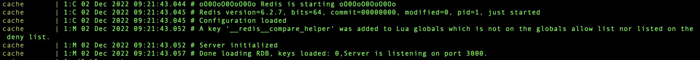
<div align="center"><em>The message 'Server initialized' lets us know that Redis is ready</em></div>

<br>
<br>

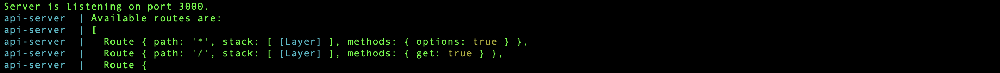
<div align="center"><em>The server is listening at port 3000</em></div>

<br>
<br>

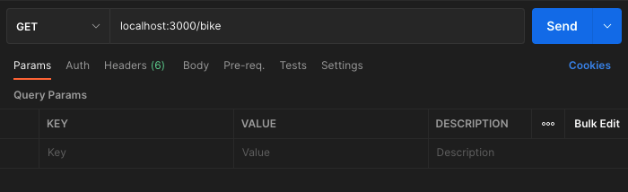
<div align="center"><em>The url to our Redis-entangled route in postman</em></div>

<br>
<br>

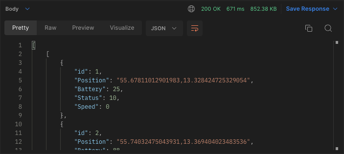
<div align="center"><em>Postman fetch with no cache</em></div>

<br>
<br>

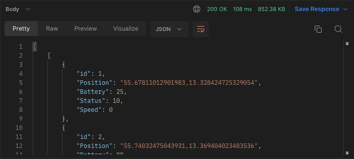
<div align="center"><em>Postman fetch with cache</em></div>

## **Summary**
Today we learned the basics of Redis and how, when and where to use it. Inside a docker container we experimented with the basic methods and data types of Redis. After a use-case for the current project was identified, an implementation of Redis on a single route was made. The route used the **GET** and **SETEX** to set a timed cache.

We ran a simple test to see if we could verify the effect of Redis. Through Postman a fetch was made on the 69452 lines of bikes that resides in the 'bike' route. Out first attempt when there were no cache resulted in a response time of 671ms, the second attempt, where Redis just cached the data, had a response time of 108ms.

The results showcases the power of Redis, with the in-memory cache store we fetch frequently accessed data a lot faster, in this case ~6 times faster. Not the promised 10-50 times faster but still very impressive.

I'm convinced to add Redis to more routes in our project, especially where the database have heavier calculations and the response time might be slower.

